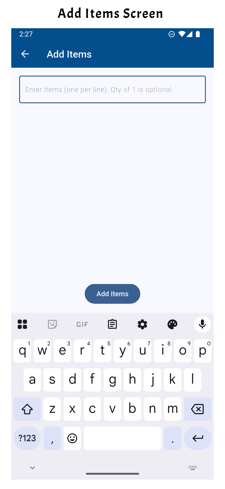
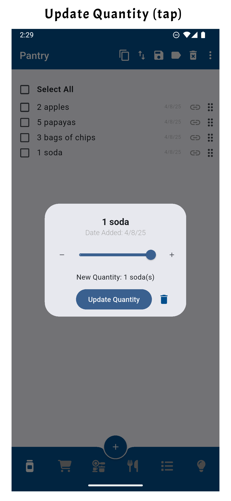

# Panda Planner App

A simple and intuitive mobile app built with Flutter that helps you keep track of all your lists. Meant to be a no-frills, offline app, not requiring creation or access to any accounts.

Originally created to help manage pantry items, its main features were to allow you to easily update quantities as you go through them and track when they were added, so you can use up anything that's been sitting around for a while.

Beyond pantry management, the app has expanded and can handle applications including shopping, meal planning, to-do lists, and more, offering an all-in-one solution for planning and managing your daily tasks, food-related needs, and other situations where lists are useful.

The app allows you to quickly add multiple items at once, modify quantities, delete items, and organize them with customizable tags. It also includes features for managing lists, importing and exporting data, as well as sorting items based on different criteria.

## Features

- **Manage lists**: Add, remove, or edit the available lists. Also has an option to reset to defaults.
- **Add multiple items**: Easily input new items along with their quantities.
- **Edit items**: Edit quantity, name, and date added of any item.
- **Add links**: Add a link, with ability to launch the URL.
- **Modify item quantities**: Quickly change the quantity of any item.
- **Delete items**: Remove items from your list, including support for deleting multiple selected items at once.
- **Copy items**: Copy items to clipboard for sharing.
- **Tag items**: Assign customizable tags to items for better organization. Select items by tag.
- **Import/Export**: Import and export data using JSON, CSV, and XLSX files.
- **Sorting**: Sort items by name, date added, or tag.
- **Move items**: Move selected items between shopping list and pantry directly.
- **Reordering items**: Rearrange the order of items in the list via drag and drop.
- **Mark items as completed**: Mark simple list items as completed or incomplete.

## Key Features in Detail

- **Item Interaction Features**
  - **Add items**: Add items by clicking the + icon at the bottom, above the navigation bar. Multiple items can be entered at once on separate lines. If it is a list with countable items, enter the quantity before the item name. If no quantity is provided, the count automatically defaults to 1.
  - **Edit items**: Long press the item if you would like to manually update the quantity, name, or date added. You can even add a URL with easy access to launching the provided link.
  - **Update quantity**: If the item has a count, you can quickly change the quantity by tapping on it. You can adjust item quantities by tapping the item and using a simple UI with increment/decrement buttons or a slider.
  - **Update completion**: For non-countable items, tapping the item marks it as complete or incomplete.
  - **Reordering Items**: Users can reorder items with the drag-and-drop interface on the right side.
  - **Checkboxes**: Select items using the checkboxes for various interactions with the top toolbar.
  - **Tags**: Tap on a tag to select all items with the same tag.
  - **Links**: If a URL is specified for the item, tap on the link icon to directly access the website.

- **Toolbar Features**
  - **👁️ Select and view completed items**: Select as well as toggle the visibility of completed items in the list.
  - **📋 Copy**: Copy selected items to clipboard.
  - **↕️ Sorting**: Sort items by `Name`, `Date Added`, `Tag`, or your own manual order (from using the drag-and-drop interface).
  - **💾 Saving and loading**: Load from and save to a JSON, CSV, or XLSX file, useful for backup and sharing. When you load, you can choose to add to the list or to completely replace the current list. You can also save the whole list or selected items. In addition to individual lists, you can import and export all the data in the app at once.
  - **🏷️ Multi-select tagging**: Categorize multiple selected items at once using tags. The labels can be edited to your preferences.
  - **🗑️ Multi-select deletion**: Delete multiple selected items at once.
  - ** Popup menu**:
    - **🚚 Move Items**: Easily move selected items from the list to a different list. By default, items will move to the list specified during creation, but you can also choose from any available list in the dropdown menu.
    - **✏️ Manage Lists**:
      - **Add**: Allows you to create a new list with a variety of custom settings and preferences. You can set the list’s title, choose an icon, decide whether the items within the list have a count, and specify the default list items should be moved to. Additionally, you can add tags to the list, which could be preset tags based on item type or custom tags you create as a comma-delimited list. Note that titles have to be unique. If you create a list with an identical title to a previous list, it updates the previous list with any new settings and moves it to the end.
      - **Delete**: To remove any list that is no longer needed, simply click on the title of the list. This action performs a "soft" delete, meaning that if you later create a new list with the same title, the list items can be recovered, keeping your data safe while decluttering.
      - **Edit**: Allows you to reorder lists and modify various aspects of the existing lists, including whether items are countable, the list's icon, the default list to move items to, and managing tags.
      - **Reset**: This option restores the app to its original configuration, resetting all lists back to the default 6 lists that come with the app. It's helpful if you want to start fresh or revert any changes made.
    - **❓ How to Use**: Access these detailed instructions on how to use the app.
    - **ℹ️ Info**: Short snippet about purpose of app.

## Screenshots
<div style="text-align: left;">
  
  
  
  
  
  
  
  
  
  
  
  
  
  
  
  
</div>

## Getting Started

### Prerequisites

- **Flutter** is required to build the app for both Android and iOS. To install Flutter, follow the instructions on the official Flutter website: [Flutter Installation Guide](https://flutter.dev/docs/get-started/install).
- **Android SDK** is needed to develop and run the app on Android devices. The Android SDK is included with Android Studio. Download and install **Android Studio**: [Download Android Studio](https://developer.android.com/studio).
- Once you have Flutter and the required SDKs installed, run `flutter doctor` to check for any missing dependencies and verify your environment setup.

### Installation

1. Clone the repository:
   ```bash
   git clone https://github.com/AMWen/pantry_app.git
   cd pantry_app
    ```

2. Install dependencies:
```bash
flutter pub get
```

Examples are:
- Hive for local storage
- `build_runner` for code generation

3. To generate necessary files for Hive, run the following:

```bash
dart run build_runner build
```

4. To use the flutter icon picker, you need to generate the IconPacks to use from the `fluterr_iconpicker` package.

```bash
dart run flutter_iconpicker:generate_packs --packs material,cupertino,..
```

5. To customize the app's launcher icon, you can use the `flutter_launcher_icons` package. Update `flutter_launcher_icons.yaml` accordingly then run the following command to generate icons for your app:

```bash
dart run flutter_launcher_icons:main
```

flutter_iconpicker 

6. Once you're ready to release the app, you can generate a release APK using the following commands:

For android:
```bash
flutter build apk --release --no-tree-shake-icons
```

or 
```bash
flutter build appbundle --no-tree-shake-icons
```

For iOS (need to create an an iOS Development Certificate in Apple Developer account):
```bash
flutter build ios --release
```

#### Troubleshooting iOS Code Signing Issues
If you encounter the "No valid code signing certificates were found" error when building for iOS, follow these steps to fix it:

- Enroll with the Apple Developer app on your iPhone, iPad, or Mac if not done already
  - Download the Apple Developer app from App Store
  - Select the Account tab and sign in to continue
  - Click Enroll Now (costs ~$100/year)
- Add device to Developer Portal
  - Go to the Apple Developer Portal
  - Log in with your Apple Developer account credentials
  - Under the Certificates, Identifiers & Profiles section, go to Devices
  - Click on the "+" (Add Device) button
  - Enter a name for your device and device ID (UDID)
      - To find your device’s UDID, connect the device to your Mac, open Xcode > Devices and Simulators window, select your device, and copy the Identifier
  - Click Continue to add the device
- Set up code signing certificates
  - Open Xcode: Open your iOS project in Xcode (ios/Runner.xcworkspace)
    ```bash
    open ios/Runner.xcworkspace
    ```
  - Configure Code Signing: Ensure you have the correct signing settings:
      - Select the 'Runner' project in the navigator then the 'Runner' target in the project settings
      - Under the Signing & Capabilities tab, set the Team and Bundle Identifier (needs to be unique)
      - Register your device with your Apple Developer Account
      - Let Xcode automatically provision a profile for your app (Automatically manage signing is checked).
  - Certificates: Ensure you have valid certificates for signing in your Apple Developer account.
      - Trust your newly created Development Certificate on your iOS device via BoxSettings > General > Device Management > [your new certificate] > Trust

## Tech Stack

- **Flutter**: The app is built using Flutter for a cross-platform mobile experience, targeting both Android and iOS devices.
- **Hive**: A lightweight, fast key-value database used for local storage, storing pantry items offline.
